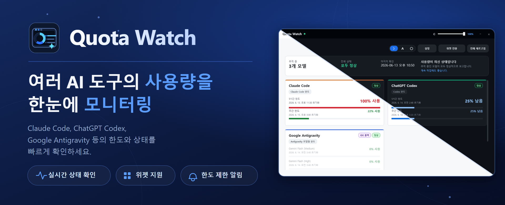

# Quota Watch



---

<p align="center">
  <a href="README.md">한국어</a> |
  <a href="README_EN.md">English</a>
</p>

<p align="center">Codex · Claude Code · Google Antigravity의 사용 한도를 한 화면에서.</p>

---

**Quota Watch**는 Codex, Claude Code, Google Antigravity의 사용 한도와 quota 상태를 한 화면에서 확인하는 Windows 데스크톱 앱입니다. 트레이 아이콘과 대시보드를 통해 현재 사용량, reset 시점, provider별 로그인 상태를 빠르게 확인할 수 있습니다.

> [!IMPORTANT]
> 현재 릴리즈 채널은 `v0.0.2 Public Beta`입니다. 이 앱은 각 provider의 로컬 로그인 정보와 비공식/내부 quota API를 사용하므로 provider 변경에 따라 일시적으로 조회가 실패할 수 있습니다. 인증 토큰은 로컬에서만 읽고, Quota Watch 서버로 전송하지 않습니다.

## 시스템 요구사항

- Windows 10 버전 1809(빌드 17763) 이상, 64비트(x64)
- 표시 언어: 영어, 한국어, 일본어, 중국어(간체) — Windows 표시 언어에 맞춰 자동 적용

## 다운로드

GitHub Releases에서 최신 릴리즈를 받으세요. 세 가지 형태로 제공합니다.

- **일반 설치 (권장)**: `Quota-Watch-Setup-<버전>-win-x64.exe` — .NET 런타임이 포함된 self-contained 설치 프로그램. 별도 런타임 설치 없이 바로 실행됩니다.
- **웹 설치 (작은 용량)**: `Quota-Watch-WebSetup-<버전>-win-x64.exe` — .NET 10 Desktop Runtime이 없으면 설치 중에 내려받습니다. 인터넷 연결이 필요하고, 런타임 설치 단계에서 관리자 권한을 요청합니다.
- **설치 없이 실행**: `Quota-Watch-<버전>-win-x64-portable.zip` — 압축만 풀면 바로 쓰는 self-contained 빌드.

설치 프로그램은 관리자 권한 없이 현재 사용자 계정에만 설치됩니다(웹 설치의 런타임 다운로드 단계는 예외).

## 설치 방법

### 설치 프로그램 사용

1. Releases에서 일반 설치 `Quota-Watch-Setup-<버전>-win-x64.exe` 또는 웹 설치 `Quota-Watch-WebSetup-<버전>-win-x64.exe`를 다운로드합니다.
2. 설치 파일을 실행합니다. 웹 설치 프로그램은 .NET 10 Desktop Runtime이 없을 때만 다운로드 여부를 묻습니다.
3. 설치 중 바탕화면 아이콘과 Windows 시작 시 자동 실행 옵션을 선택할 수 있습니다(둘 다 기본 해제).
4. 설치가 끝나면 시작 메뉴나 바탕화면 바로가기로 실행하고, Windows 트레이 아이콘에서 대시보드를 엽니다.

### portable zip 사용

1. Releases에서 `Quota-Watch-<버전>-win-x64-portable.zip`을 다운로드합니다.
2. 원하는 폴더에 압축을 풉니다.
3. 압축을 푼 폴더의 `QuotaWatch.exe`를 실행합니다.

## 주요 기능

- Codex, Claude Code, Google Antigravity 사용량 확인
- 공급자에 맞춰 5시간·주간 또는 모델별 quota window 표시
- 한도 소진 알림 기능
- provider별 로그인 및 설정 문제 안내
- 트레이 아이콘과 프로필 전환 지원
- provider 자동 새로고침 및 실패 시 retry backoff
- 진단 로그 기록 및 복사 시 token, secret, password 등 민감 정보 redaction

## Provider별 준비

### Codex

Codex가 설치되어 있고 로그인되어 있어야 합니다. Quota Watch는 `%USERPROFILE%\.codex\auth.json` 또는 `CODEX_HOME\auth.json`의 OAuth 인증 정보로 먼저 클라우드 한도를 조회하므로, 인증 정보가 유효하면 Codex를 계속 실행해 둘 필요는 없습니다. 인증 정보가 없거나 만료되면 앱에 설치/로그인 안내가 표시됩니다.

### Claude Code

Claude Code OAuth 인증 정보가 필요합니다. Quota Watch는 다음 정보를 순서대로 확인합니다.

- `CLAUDE_CODE_OAUTH_TOKEN`
- `CLAUDE_CONFIG_DIR`
- `%USERPROFILE%\.claude\.credentials.json`

인증 정보가 있으면 Claude Code 앱을 계속 켜둘 필요는 없습니다.

### Google Antigravity

Antigravity에서 Google 계정으로 로그인되어 있어야 합니다. Quota Watch는 다음 정보를 사용합니다.

- `%USERPROFILE%\.antigravity\oauth_creds.json`
- `ANTIGRAVITY_OAUTH_ACCESS_TOKEN`
- 로컬 Antigravity 저장소의 액세스 토큰과 갱신 토큰. 만료된 토큰을 IDE 없이 갱신하려면 로컬 저장소에 OAuth 클라이언트 값이 있거나 사용자가 `ANTIGRAVITY_OAUTH_CLIENT_ID` / `ANTIGRAVITY_OAUTH_CLIENT_SECRET`을 직접 설정해야 합니다.
- `%APPDATA%\Antigravity IDE\User\globalStorage\state.vscdb`
- `%APPDATA%\Antigravity\User\globalStorage\state.vscdb`

IDE를 켜지 않고도 만료된 토큰을 갱신하려면 설정 > Antigravity OAuth에서 본인 OAuth 클라이언트 ID·시크릿을 저장하세요. 이 값은 Google Cloud Console에서 OAuth 데스크톱 앱을 만들 때 발급되며, IDE에 연결하는 용도가 아니라 Antigravity의 Google 로그인으로 만들어진 갱신 토큰을 Quota Watch가 IDE 없이 새로 고칠 때 사용합니다. 저장된 값은 평문이 아니라 Windows DPAPI로 현재 사용자 계정에 암호화됩니다. 환경변수 `ANTIGRAVITY_OAUTH_CLIENT_ID` / `ANTIGRAVITY_OAUTH_CLIENT_SECRET`도 그대로 쓸 수 있습니다.

저장된 인증 정보가 유효하면 Antigravity 또는 Antigravity IDE를 계속 실행해 둘 필요는 없습니다. 클라우드 한도를 직접 읽을 수 없으면 실행 중인 Antigravity IDE의 로컬 엔드포인트를 보조 경로로 시도합니다.

## 문제가 생기면

대시보드의 공급자 카드에 표시되는 안내를 먼저 확인하세요.

- `설치/로그인 필요`: 공급자 앱 설치 또는 로그인이 필요합니다.
- `실행/로그인 필요`: 공급자 앱 또는 IDE를 실행하고 로그인 상태를 확인해야 합니다.
- `인증 필요`: 인증 정보가 없거나 만료되었습니다.
- `시간 초과`: 공급자 응답이 너무 늦습니다. 잠시 뒤 다시 시도하세요.
- `네트워크 문제`: 네트워크 또는 공급자 서비스 상태를 확인한 뒤 다시 시도하세요.
- `응답 해석 실패`: 공급자 응답 형식이 예상과 다릅니다.
- `한도 정보 없음`: 응답은 있었지만 표시할 한도 정보가 없습니다.

진단 로그가 필요하면 PowerShell에서 아래처럼 실행하세요.

### 설치 프로그램으로 설치한 경우

```powershell
$env:AILIMIT_DEBUG_LOG="1"
& "$env:LOCALAPPDATA\Programs\Quota Watch\QuotaWatch.exe"
```

만약 위 경로에서 실행 파일을 찾지 못하면 시작 메뉴의 Quota Watch 바로가기를 우클릭한 뒤 파일 위치를 열어 실제 설치 경로를 확인하세요.

### portable zip으로 실행하는 경우

압축을 푼 폴더에서 PowerShell을 열고 실행합니다.

```powershell
$env:AILIMIT_DEBUG_LOG="1"
.\QuotaWatch.exe
```

로그 위치:

```text
%APPDATA%\AiLimit\dashboard-debug.log
```

진단 로그 기능은 액세스 토큰, 갱신 토큰, 클라이언트 시크릿, API 키, 비밀번호, bearer 토큰, Antigravity CSRF 인수 같은 민감 정보를 가린 뒤 파일에 기록하거나 클립보드에 복사합니다.

## 개발자용 명령

저장소 root에서 PowerShell로 실행합니다.

```powershell
dotnet restore .\quota-watch.slnx
dotnet build .\quota-watch.slnx
dotnet test .\quota-watch.slnx
dotnet run --project .\src\AiLimit.App\AiLimit.App.csproj
```

릴리즈 패키지 생성:

```powershell
powershell -ExecutionPolicy Bypass -File .\packaging\build-release.ps1 -Version <버전>
```

생성 결과:

- `artifacts/release/Quota-Watch-<버전>-win-x64-portable.zip`
- `artifacts/release/Quota-Watch-Setup-<버전>-win-x64.exe`
- `artifacts/release/Quota-Watch-WebSetup-<버전>-win-x64.exe`

테스트 환경에서 temp 폴더 권한 문제가 있으면 다음처럼 실행합니다.

```powershell
$env:TEMP="$PWD\.tmp"; $env:TMP="$PWD\.tmp"; dotnet test .\quota-watch.slnx --no-restore -c Release --verbosity minimal
```
